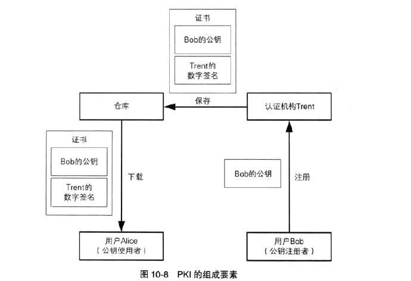

在现代社会数据电子化以后，数据的使用变得非常方便，但是数据安全的保证也面临巨大的挑战。如何保证数据不被窃取，篡改等问题。为了解决这些问题，人们开发了各种各种密码技术。本文为《图解密码学》的读书笔记，将简单介绍一个开发工程师应该掌握的基本的密码学知识。

## 密码学基本知识

在消息的传递过程中为了保证消息的机密性（除了接受者，其他都不允许知道），消息在计算机传递过程中，内容本应该只有A，B能知道，但是由于消息经受了多个设备与机器（中间商），如果不采取一定的措施的话，这些中间商就能知道消息的传递内容。下面将介绍几种措施。

1. 解决消息的加密（防止中间商知道）的**对称加密技术**，**非对称解密技术**
2. 解决消息完整性，未篡改的**单向散列函数技术**
3. 确保消息来自期望的对方的**消息认证码技术**，他不仅能保证消息完整性，还能提供认证机制

4. 解决篡改，否认等技术的数字签名。如A发邮件B打欠条100W，在邮件传输过程可能发到伪装成B地址的C去了，有可能邮件在中间商时候被改为了1W，有可能B收到了邮件，后续A说没发（否认）。数字签名则将现实世界的签名盖章一直到了数字世界。数字签名是一种你能确保完整性，提供认证并且防止否认的密码技术

### 0.信息安全面临的问题

1. **信息安全受到以下威胁**

    - 窃听 -- 消息被第三方知道
    - 篡改 -- 消息被篡改
    - 伪装 -- 伪装成真正发送者
    - 否认 -- 事后称自己没有发送

2. **为了应对以上威胁产生了如下密码技术**

    - 对称加密
    - 公钥密码
    - 单向散列函数
    - 消息认证码
    - 数字签名
    - 伪随机数生成器

3. **密码技术解决的问题**

### 1.对称加密

对称加密是指用相同的密钥进行加密与解密，本节将介绍对称加密中数据的编码，基本原理，几种对称加密算法

#### 1.计算机操作的对象

计算机中数据的表示是01序列，加密所做的工作就是讲明文01序列表示的信息转化为密文01序列，比特位是加密操作的操作数。

#### 2.XOR异或操作

单个比特的XOR操作规则如下：

	    1 XOR 1 = 0
	    1 XOR 0 = 1
	    0 XOR 1 = 1
	    0 XOR 1 = 0

总结一下就是相同得0，不同得1
bit间的XOR 可以很容易得到如下特征:

	A XOR B == C  如果 A == B ，则 C = 0
	A XOR 0 ==A
	B XOR 0 == B
	(A XOR B ) XOR B == A   ==>  C  XOR B = A

从最后一个公式可以看出这个与加密解密的步骤非常相似

- 明文A通过秘钥B加密得到C
- 密文C通过密码B解密可以还原到A的明文

如果选择合适的B，XOR就可以实现一个高强度的密码

#### 3.DES

1. 1977年美国联邦信息处理标准所采用的一种对称密码，现在已经能被暴力破解。DES是一种将64比特的明文加密成64比特密文的对称密码算法，密匙长度是56比特。但由于每隔7比特会设置用于错误检查的比特，因此密匙长度实际是56比特。DES基本结构也被称为Feistel网络，加密的各个步骤称为轮，整个加密的过程就是进行若干次轮的循环。DES是一种16轮循环的Feistel网络。

2. 现在DES已经能够被暴力破解，开发了3DES算法--将DES重复3次得到的算法

#### 4.AES

AES(Advanced Encryption Standard)取代DES成为新标准的一种对称密码算法。在2000年从候选算法中选出了一种名为Rijndael的对称密码算法。

分组长度是128比特。在AES规格中，密匙长度只有128、1192、256比特三种。

逐个的对16字节的输入数据进行SubBytes处理。即以每个字节的值(0~255)为索引进行替换，即将一个字节的值替换成另一个字节的值。将输出以字节为单位进行打乱处理（有规律的）以一个4字节的值进行比特运算，将其变成另外一个4字节的值。将输出与轮密匙进行XOR。Rijndael需要重复进行10~14轮计算。

目前为止还没有出现针对Rijndael的有效攻击。

#### 5.分组模式

1. DES，AES都是分组密码他们只能加密固定长度的明文，如果需要加密任意长度的明文就需要对分组密码进行迭代，迭代方式就是分组模式
2. 常见的分组模式

    1. **ECB模式** ：明文分组单独加密，最后组合。相同的明文会被转换为相同的密文。只要观察一下密文，就知道明文存在怎样的重复组合，并以此为线索破解密码。并且在ECB模式中，每个明文分组都各自独立的加密和解密，攻击者可以改变密文分组的顺序。不推荐使用。

    2. **CBC模式**：将明文分组与前一个密文分组进行XOR计算，然后再加密

    3. **CFB模式**
    4. **OFB模式**
    5. **CTR模式**
在以上的分组密码中用哪一类呢，《应用密码学》建议使用CBC和CTR模式。

### 2.公钥密码

公钥密码中加密用的秘钥与解密用的密钥是不一样的，发送者使用公钥加密，加密的内容私钥才能解开。公钥密码解决了秘钥配送问题，但是他的加密速度很慢比对称密码慢1百万倍。

#### 1.秘钥配置

对称密码有秘钥配送问题（如何将秘钥安全的发送到接受者手中）现在有办法有

- 共享密匙
- 密匙分配中心
- Diffie-Hellman密码交互
- 公钥密码

#### 2.RSA算法

非常优雅与简单与复杂的算法：

example: TODO
一旦发现了对大整数进行质因数分解的高效算法，RSA就能被破译。

#### 3.中间人攻击

仅靠公钥密码本身，是无法防御中间人攻击的。要防御中间人攻击，还需要一种手段来确认所收到的公钥是否真的属于Bob，这种手段称为认证。

### 3.单向散列函数

单向散列函数（hash函数）获取消息的“指纹”。他也叫消息摘要函数。他用来确认明文的完整性，或者是否被篡改。单向散列函数有一个输入和输出，输入称为消息，输出称为散列值。

1. **MD4、MD5**

    - MD4产生128比特的散列值，现在已经不安全。
    - MD5产生28比特的散列值，目前MD5的强碰撞性已经被攻破。

2. **SHA-1、SHA-256、SHA-384、SHA-512SHA-1**

    - SHA-1产生160比特的散列值，强碰撞性于2005年被攻破。
    - SHA-256、SHA-384、SHA-512统称SHA-2，散列长度分别为256,384,512比特。SHA-2尚未被攻破。

3. **他不能解决认证问题**

### 4.消息认证码

1. **使用消息认证码目的**

    - 可以防止消息是否被篡改，
    - 是否有人伪装

2. **消息认证码流程**

3. **存在问题**

    - 共享秘钥的配。
    - 无发防止否认

### 5.数字签名

1. 消息认证码之所以无法防止否认，是因为发送者和接受者共享密钥。对于第三方来说，我们无法证明这条消息是由发送发生成的，因为接收方也可以伪造此消息。所以，我们可以模仿公钥密码，发送方使用只有自己知道的密钥。这样只有发送方可以正确解密的消息，这样就可以防止发送方的否认。但是如果数字签名的生成者说：“我的私钥被别人窃取了”，怎么办？只有报警吧

2. 数字签名还是无法防止中间人攻击，要防止，必须确认自己得到的公钥是否真的属于自己的通信对象。可以打电话核对公钥的散列值，也可以使用公钥证书。证书公钥证书记有姓名、组织、邮箱地址等个人信息，以及属于此人的公钥，并由认证机构（CA）施加数字签名。只要看到公钥证书，我们就知道认证机构认定该公钥的确属于此人。

其中(1)(2)(3)仅在注册新公钥才会进行，并不是每次通信需要，(4)仅在发送方第一次用公钥密码向接受者发送消息才会进行，公钥可以保存在电脑中。公钥基础设施（PKI）公钥基础设施，为了更有效的运用公钥而制定的一系列规范和规格的总称。

规范包括证书由谁颁发，如何颁发，私钥泄露时应该如何作废证书，计算机之间的数据交换应该采用怎样的格式。基本要素用户认证机构仓库

1. **认证机构（CA）认证机构的工作**

    - 生成密钥对（也可由用户生成）
    - 注册公钥时对本人身份进行认证
    - 生成并颁发证书
    - 作废证书

2. **作废证书**

CRL做作废证书，认证机构需要制作一张证书作废清单CRL，PKI用户需要从认证机构获取最新的CRL，并查询自己要用于验证签名的公钥是否作废。证书层级结构

3. **对证书的攻击**

    - 在公钥注册之前攻击
    - 注册相似人名进行攻击
    - 窃取私钥伪装成认证机构
    - 钻CRL空子

### 6.DH秘钥交换

通信双方仅仅通过**交换一些公开的信息**就能生成出共享的私密数字，这一私密数字就能用来作为对称加密的密钥。

### 7.随机数

1. **随机数的用途**

    - 生成密钥 用于对称密码消息认证码
    - 生成密钥对 用于公钥密码与数字签名
    - 生成初始化向量 用于分组密码的CBC，CFB，OF模式
    - 生成nonce值 用来防止重复攻击
    - 生成盐

2. **随机数的特征**

    - 随机性
    - 不可预测性
    - 不可重现性

3. **随机数的破解**

    - 对种子进行攻击
    - 对随机数池进行攻击